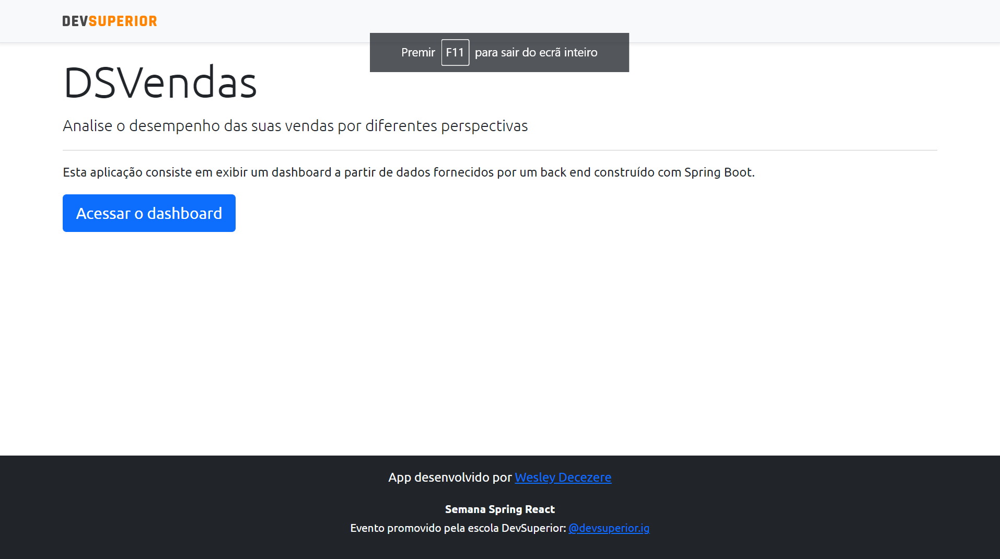

# Projeto SDS3

> *Dashboard de vendas desenvolvido durante a [Semana Dev Superior 3](https://github.com/devsuperior/sds3).*

   

### Live

O projeto pode ser acessado pelo endereço [sdsvendas.wadworks.space](sdsvendas.wadworks.space).

## Tecnologias e ferramentas utilizadas
* Spring Boot
* ReactJS
* PostgreSQL
* Postman, Netlify e Heroku

### Backend

O *backend* da aplicação, hospedado no Heroku, foi desenvolvido em Java, fazendo uso do *framework* Spring Boot. Os gerenciamento do banco de dados foi realizado com PostgreSQL. A [API](https://sds3-decezere.herokuapp.com) implementada conta com quatro *endpoints*:
* `sellers`: ID e nome de todos os vendedores cadastrados
* `sales`: Dados completos de todas as vendas cadastradas. Aqui é possível, por exemplo, filtrar o resultado da consulta por página, definir o número de registros por página e ordenandená-los por data, ao passar `?page={}&size={}&sort=date,desc`
* `sales/amount-by-seller`: Soma do valor de todas vendas de cada vendedor
* `sales/success-by-seller`: Total de negócios iniciados e de negócios fechados de cada vendedor

### Frontend

No *frontend*, utilizou-se TypeScript e a biblioteca ReactJS. O *deploy* da interface foi feito no Netlify, através da integração com o no GitHub.